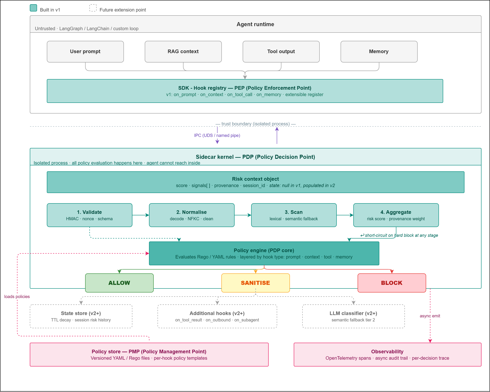
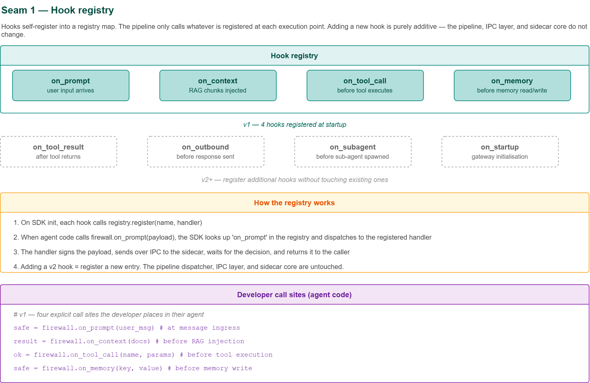
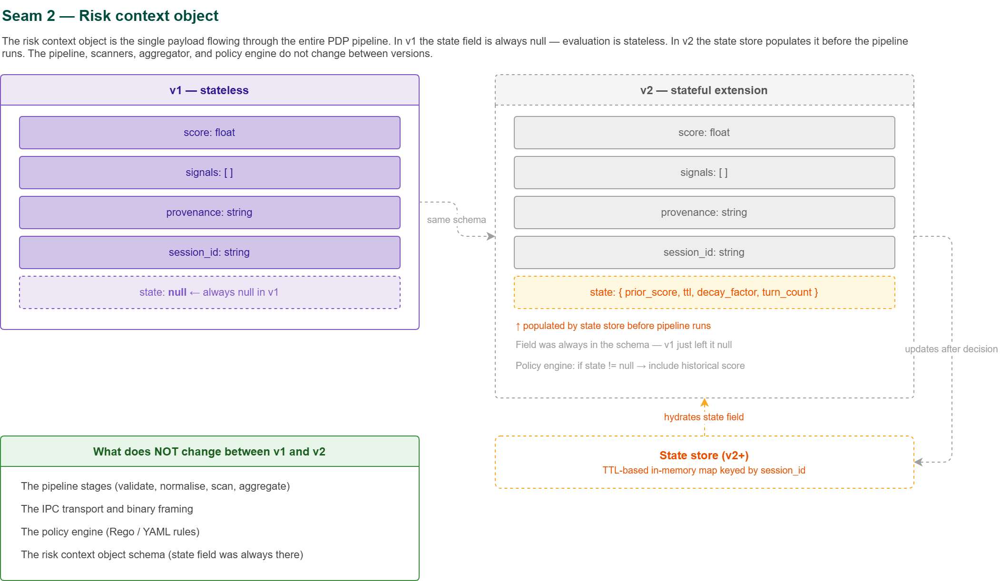

# ACF-SDK Architecture

## Overview

ACF-SDK (Agentic Cognitive Firewall SDK) is a framework-agnostic security layer for LLM agents. It distributes enforcement across the full agent lifecycle through explicit hook call sites rather than a single input boundary.

The system is divided into two zones separated by a hard trust boundary:

- **PEP** (Policy Enforcement Point) — the SDK interceptor that lives inside the agent process
- **PDP** (Policy Decision Point) — the sidecar kernel that runs as a completely isolated process

All policy evaluation happens in the sidecar. The agent cannot reach inside it.

---

## System diagram



---

## Seam 1 — Hook registry



Hooks self-register into a registry map. The pipeline only calls whatever is registered at each execution point. Adding a new hook is purely additive — the pipeline, IPC layer, and sidecar core do not change.

### v1 hooks (registered at startup)

| Hook | Fires when | Primary threat |
|---|---|---|
| `on_prompt` | User input arrives | Direct prompt injection — override system instructions |
| `on_context` | RAG chunks injected | Indirect injection — malicious instructions in retrieved docs |
| `on_tool_call` | Before tool executes | Tool abuse — unsafe tool or malicious parameters |
| `on_memory` | Before memory read/write | Memory poisoning — malicious values in persistent state |

### v2+ hooks (register without touching existing ones)

| Hook | Fires when |
|---|---|
| `on_tool_result` | After tool returns |
| `on_outbound` | Before response sent |
| `on_subagent` | Before sub-agent spawned |
| `on_startup` | Gateway initialisation |

### How the registry works

1. On SDK init, each hook calls `registry.register(name, handler)`
2. When agent code calls `firewall.on_prompt(payload)`, the SDK looks up `on_prompt` in the registry and dispatches to the registered handler
3. The handler signs the payload, sends over IPC to the sidecar, waits for the decision, and returns it to the caller
4. Adding a v2 hook = register a new entry. The pipeline dispatcher, IPC layer, and sidecar core are untouched.

### Developer call sites (agent code)

```python
# v1 — four explicit call sites the developer places in their agent

safe   = firewall.on_prompt(user_msg)        # at message ingress
result = firewall.on_context(docs)           # before RAG injection
ok     = firewall.on_tool_call(name, params) # before tool execution
safe   = firewall.on_memory(key, value)      # before memory write
```

---

## Seam 2 — Risk context object



The risk context object is the single payload flowing through the entire PDP pipeline. In v1 the `state` field is always null — evaluation is stateless. In v2 the state store populates it before the pipeline runs. The pipeline, scanners, aggregator, and policy engine do not change between versions.

### v1 — stateless

```
{
  score:      float        # aggregated risk score 0.0–1.0
  signals:    []           # named signals from scanner stages
  provenance: string       # origin of the payload
  session_id: string       # session identifier
  state:      null         # always null in v1
}
```

### v2 — stateful extension (same schema)

```
{
  score:      float
  signals:    []
  provenance: string
  session_id: string
  state: {                 # populated by state store before pipeline runs
    prior_score:   float
    ttl:           int
    decay_factor:  float
    turn_count:    int
  }
}
```

The `state` field was always in the schema — v1 just leaves it null. The policy engine checks `if state != null` before including historical score. Same policy files work in both versions without modification.

### v2 state store

A TTL-based in-memory map keyed by `session_id`. Hydrates the `state` field before the pipeline runs, then updates after the decision is returned.

```
state store ──hydrates──▶ risk context ──pipeline──▶ decision
     ▲                                                   │
     └──────────────── updates after decision ───────────┘
```

### What does NOT change between v1 and v2

- The pipeline stages (validate, normalise, scan, aggregate)
- The IPC transport and binary framing
- The policy engine (Rego / YAML rules)
- The risk context object schema (state field was always there)

---

## IPC transport

Communication between the PEP and PDP uses a Unix Domain Socket at `/tmp/acf.sock` with length-prefixed binary framing.

**Frame format:**

| Field | Size | Description |
|---|---|---|
| Magic byte | 1 byte | Fixed value `0xAC` — fast-reject misaddressed connections |
| Version | 1 byte | Protocol version (current: 1) |
| Payload length | 4 bytes | Length of JSON payload |
| Nonce | 16 bytes | Random per-request — replay protection |
| HMAC | 32 bytes | HMAC-SHA256 over (version + length + nonce + payload) |
| Payload | variable | JSON-serialised risk context object |

The sidecar validates the 54-byte header before touching the JSON payload. An invalid HMAC or reused nonce drops the connection immediately.

**Response frame:**

| Field | Size | Description |
|---|---|---|
| Decision | 1 byte | `0x00` ALLOW · `0x01` SANITISE · `0x02` BLOCK |
| Sanitised payload length | 4 bytes | 0 if decision is not SANITISE |
| Sanitised payload | variable | Present only on SANITISE |

---

## Pipeline stages

All stages run inside the sidecar. The pipeline short-circuits and returns BLOCK immediately if any stage produces a hard block signal.

### 1. Validate
HMAC verification, nonce check against replay store, schema validation. Invalid frames are dropped in microseconds before any payload parsing.

### 2. Normalise
Recursive URL and Base64/hex decoding, Unicode NFKC normalisation, zero-width character stripping, leetspeak cleaning. Produces canonical text for scanning.

### 3. Scan
Aho-Corasick multi-pattern lexical scan on canonical text, permission checks (allowlist lookups), integrity checks (HMAC verification for memory reads). Semantic scan runs only on mid-band inputs that lexical scanning cannot resolve.

### 4. Aggregate
Combines scanner signals into a risk score, applies provenance trust weight, produces the final risk context object for OPA.

### Policy engine
OPA Go SDK embedded in the sidecar. Evaluates the Rego policy file matching the `hook_type` field. Returns a structured decision object:

```json
{
  "decision": "SANITISE",
  "sanitise_targets": {
    "matched_patterns": ["ignore previous instructions"],
    "action": "strip_matched_segments",
    "inject_prefix": "[WARNING: partial injection attempt detected]"
  }
}
```

OPA declares *what* to sanitise. The sidecar executor performs the actual string transformation.

---

## Policy store (PMP)

Versioned YAML and Rego files on disk. Hot-reloadable — the sidecar watches for file changes and reloads without restarting.

```
policies/
└── v1/
    ├── prompt.rego          instruction override · role escalation · thresholds
    ├── context.rego         source trust · embedded instruction · structural anomaly
    ├── tool.rego            allowlist · shell metachar · path traversal · network
    ├── memory.rego          HMAC stamp/verify · write scan · provenance
    └── data/
        ├── policy_config.yaml         thresholds · allowlists · trust weights
        └── jailbreak_patterns.json    versioned pattern library
```

Policy logic (Rego) and policy data (YAML/JSON) are kept separate so pattern library updates and threshold tuning never require touching decision rules.

---

## Observability

OTel spans are emitted asynchronously after each decision — they never add latency to the enforcement path. If the OTel sink is unavailable, enforcement continues unaffected.

Key span attributes:

| Attribute | Value |
|---|---|
| `acf.hook_type` | Which hook triggered evaluation |
| `acf.decision` | ALLOW / SANITISE / BLOCK |
| `acf.score` | Final aggregated risk score |
| `acf.signals` | Named signals from scan stage |
| `acf.provenance` | Source origin of evaluated payload |
| `acf.policy_version` | Hash of policy file used |
| `trace_id` | W3C trace ID — links to agent's own OTel trace |

---

## Enforcement latency budget

| Step | Cost |
|---|---|
| SDK sign + frame | < 0.1ms |
| UDS write | < 0.5ms |
| Validate header | < 0.2ms |
| Normalise | 1–2ms |
| Scan | 1–3ms |
| Aggregate + policy eval | 1–2ms |
| UDS read | < 0.5ms |
| **Total typical** | **4–8ms** |
| **Total worst-case** | **~10ms** |

OTel span emission is async and does not contribute to this budget.

---

## Language decisions

| Component | Language | Reason |
|---|---|---|
| Sidecar | Go 1.22+ | OPA Go SDK embeds natively · single binary · native UDS + goroutine concurrency |
| SDK v1 | Python 3.10+ | LangGraph/LangChain first · zero external dependencies (stdlib only) |
| SDK v2 | TypeScript / Node 18+ | Same wire protocol · deferred until v1 wire protocol is proven |
| Policies | Rego + YAML | Declarative · hot-reloadable · testable with `opa test` |

---

## Build phases

### Phase 1 — Wire protocol and crypto
Goal: SDK can send a signed frame, sidecar can receive and verify it.
- `sidecar/internal/transport` — UDS listener, binary frame read/write
- `sidecar/internal/crypto` — HMAC sign/verify, nonce store
- `sidecar/pkg/riskcontext` — RiskContext struct
- `sdk/python` — Firewall skeleton, transport, frame
- Deliverable: working IPC round-trip with cryptographic verification

### Phase 2 — Pipeline stages
Goal: sidecar runs all four stages on a real payload.
- `sidecar/internal/pipeline` — all four stages
- `sidecar/internal/state/noop.go` — no-op StateStore wired in
- Deliverable: pipeline produces a populated RiskContext (hardcoded ALLOW)

### Phase 3 — OPA integration and policy files
Goal: real policy decisions from Rego files including SANITISE with targets.
- `sidecar/internal/policy` — OPA engine, executor, sanitise
- `policies/v1/` — all four Rego files and data
- Deliverable: end-to-end enforcement with sanitised responses

### Phase 4 — Observability and integration test suite
Goal: auditable, testable, production-ready v1.
- `sidecar/internal/telemetry` — async OTel span emission
- `tests/integration/` — 33-payload adversarial test suite
- SDK adapters — FirewallNode for LangGraph
- Deliverable: shippable v1 with all policies tested

### v2 (after v1 ships)
`state/ttl_store.go` · `on_output` hook · accumulation policies · TypeScript SDK · memory hook split into `on_memory_write` / `on_memory_read`
